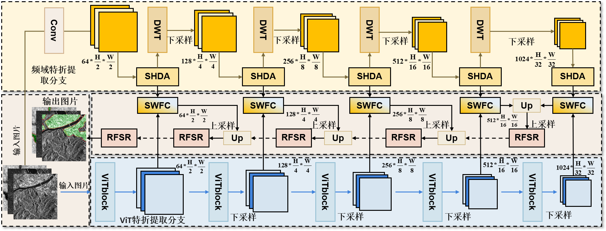

# 基于频域-空间协同的Transformer用于SAR影像地物目标提取

### [Project page](https://github.com/IMOP-lab/Depo-Net) | [Our laboratory home page](https://github.com/IMOP-lab) 

  

  Figure 1: Detailed network structure of the S3T-Net

This paper proposes a network structure based on frequency-space collaborative Transformer, as shown in Figure 1. The structure mainly relies on dual coding paths for feature extraction and fusion. The coding unit is based on discrete wavelet transform (DWT), Spectral Hierarchical Dual-Domain Attention (SHDA) and Vision Transformer (ViT), respectively. It is used to capture local texture details of SAR images in the frequency domain, reduce sensitivity to noise, and understand the overall structure and remote dependencies of images with the help of ViT's global self-attention mechanism. Then, the features of the two coding paths are integrated by collaborative weighted feature fusion (SWFC) to give full play to the complementary advantages of local and global information. In the up-sampling stage, recurrent frequency-space thinning (RFSR) module is used to combine the information of frequency domain and spatial domain, reduce the noise interference caused by sampling while recovering high-resolution features, and optimize the boundary information of the target region to obtain higher segmentation accuracy.

## Installation
Initial learning rates are uniformly set at 0.0001, with batch sizes standardized to 2 across all models. Experimental evaluations are conducted within a consistent hardware and software environment, featuring a workstation equipped with dual NVIDIA RTX 4080 Super GPUs, an AMD Ryzen R9-5950X processor, and 128GB RAM.  The experimental framework is structured in Python 3.9, employing PyTorch 2.0.0 and CUDA 11.8 for computational acceleration.

## Experiment
### Datasets
1.SARBuD 1.0 \url{https://github.com/CAESAR-Radi/SARBuD}.

2.HRSID \url{https://github.com/chaozhong2010/HRSID}.

3.FRBS \url{https://drive.google.com/file/d/15WYzzFZvAHmqSIW0PXXRTp_YVd_868l8/view}.

### Baseline
We provide GitHub links pointing to the PyTorch implementation code for all networks compared in this experiment here, so you can easily reproduce all these projects.

[U-Net](https://github.com/milesial/Pytorch-UNet);[SegNet](https://github.com/vinceecws/SegNet_PyTorch?tab=readme-ov-file);[ICNet](https://github.com/hszhao/ICNet);[MRUNet](https://github.com/cyan-utokyo/MRUnet.git);[DconnNet](https://github.com/Zyun-Y/DconnNet);[PSPNet](https://github.com/hszhao/PSPNet.git);[UNet+Att](https://github.com/EvilPsyCHo/Attention-PyTorch.git);[DAttUNet](https://github.com/faresbougourzi/PDAtt-Unet);[Attention R2UNet](https://github.com/LeeJunHyun/Image_Segmentation);[poly pvt](https://github.com/DengPingFan/Polyp-PVT.git);[BAT](https://github.com/sharkdp/bat.git);[MDViT](https://github.com/siyi-wind/MDViT.git);[TransUNet](https://github.com/Beckschen/TransUNet.git);[UNeXt](https://github.com/jeya-maria-jose/UNeXt-pytorch.git);[TransFuse](https://github.com/Rayicer/TransFuse.git);[MambaHSI](https://github.com/li-yapeng/MambaHSI.git).

#### Visual segmentation results
其中Or表示输入的原始图像，（a）~（h）列按照表3中的Dice系数以此排名的分割可视化图，（i）为S3T-Net。

  

    Figure 2:Visual segmentation results

